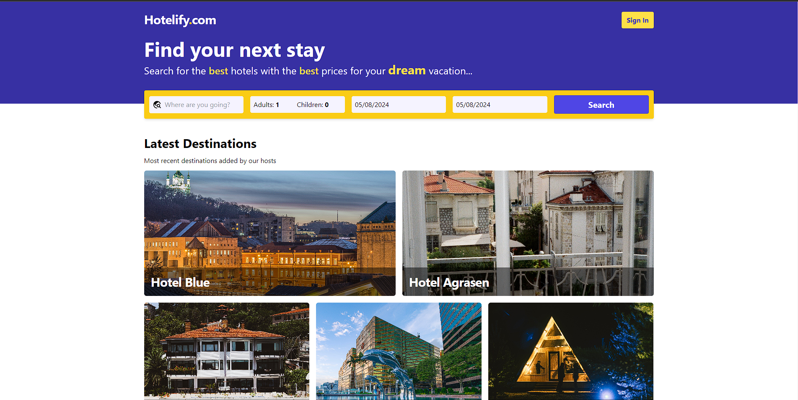

# Hotelify

**Hotelify is a full-stack web application that serves as a clone of popular hotel booking platforms like `Booking.com`.**

It provides users with the ability to search for hotels based on location, _check-in_ and _check-out_ dates, number of guests, and various other filters. Users can explore hotel details, view images, and make bookings securely using Stripe payment integration.

## Features

- **User Authentication**: Users can sign up, sign in, and securely authenticate using bcryptjs and jsonwebtoken.
- **Search and Filter**: Explore a vast array of hotels worldwide with powerful search, filter and sort options.
- **Hotel Listings**: Hotel owners can list their hotels by filling out a form with all the necessary details.
- **Image Handling**: Cloudinary is used for handling the upload and loading of hotel images.
- **Payment Integration**: Stripe is integrated for secure payment processing.
- **Responsive Design**: Built with React (Vite) + TypeScript + tailwindCSS, ensuring a smooth experience across all devices.
- **Testing**: Automated tests are written using Playwright to ensure the reliability of different features.
- **Dependencies**: Other dependencies used include react-icons, react-router-dom, react-hook-form, react-query, and react-datepicker.

## Tech Stack

- **Frontend**: React (Vite) + TypeScript + tailwindCSS
- **Backend**: Node.js, Express.js
- **Database**: MongoDB with Mongoose
- **Other Tools**: Stripe, Cloudinary, bcryptjs, jsonwebtoken, multer, playwright

## Getting Started

Access the live website [here](https://hotelify.onrender.com/).

To run Hotelify locally, follow these steps:

1. Navigate to the `backend` folder and run `npm install`.
2. Navigate to the `frontend` folder and run `npm install`.
3. Start the backend server by running `npm run dev` or `npm run build` if you prefer a production build.
4. Start the frontend server by running `npm run dev` for development or `npm run build` for a production build.
5. Access the frontend server at `http://localhost:5173`.
6. Alternatively, after building the backend, access the full project at `http://localhost:7000`.

## Contributing

Contributions are welcome! Please feel free to open issues for bug reports, feature requests, or submit pull requests.

## License

This project is licensed under the [MIT License](LICENSE).

## Acknowledgments

- Hotelify was inspired by the functionality and user experience of popular hotel booking platforms.
- Special thanks to the maintainers of open-source libraries and tools used in this project.
